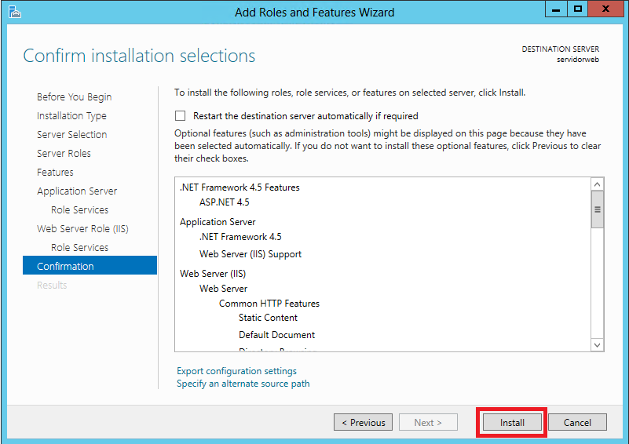

# Atividade 01

Criação do grupo de recursos, criação da máquina virtual com SQL Server e configuração da aplicação Genexus.

## Criação do grupo de recursos

Entrar no portal do Azure https://portal.azure.com, clicar no item **Grupo de recursos**.

O grupo de recursos é uma forma de organizar os itens do Azure dentro de um "grupo" para facilitar a identificação dos elementos e também facilita o gerenciamento dos custos.

Clicar em **Adicionar**.

Preencher o campo **Grupo de recursos** com o texto "HandsOnDevOps" e clicar em **Revisar + criar**.

Preencher clicar em **Criar**.

Após a criação do grupo, clicar em **Ir para o grupo de recursos**.

## Criação da Máquina Virtual

Na tela do grupo de recursos, clicar em **Adicionar**.

No campo de pesquisa digitar **Windows Server** e clicar no item **Windows Server**.

Selecionar o item **Windows Server 2012 Datacenter** e clicar em **Criar**.

Preencher o campo **Nome da máquina virtual** com o texto **servidorweb**. E clicar em **Alterar tamanho** para selecionar o tamanho da VM.

Selecionar o tamanho **D2_v3** que é uma VM com 2 cores e 8 GB de RAM. Clicar em **Selecionar** para confirmar a seleção.

Preencher o campo **Nome de usuário** com o texto **adminweb** e o campo **Senha** com **Adminhandson2019**. 
Selecione o item **Permitir portas selecionadas** e no combo **Selecione as portas de entrada** selecione o item **RDP**. 
Clique em **Revisar + criar**.

Confirmar a criação da VM clicando em **Criar**.

Após a conclusão da implantação da VM, clicar em **Ir para o recurso**.

## Instalação do Chrome 

Para facilitar o acesso ao Azure DevOps vamos instalar o Chrome na VM.

Na tela da máquina virtual, clicar na opção **Conectar**.

Clicar em **Baixar Arquivo RDP** para fazer o download do arquivo RDP para conectar a VM.

Clicar no arquivo **servidorweb.rdp**.

Informar o usuário **adminweb** e senha **Adminhandson2019** para conectar.

Inicialmente é necessário desabilitar o recurso **IE Enhanced Security Configuration**. Clique no texto **On**.

Selecione as opções **Off** e clique em **OK**.

Depois abra o Internet Explorer e faça o download e instalação do Chrome pela URL https://www.google.com/intl/pt-BR/chrome/.

## Instalação do SQL Server Express e configuração do IIS

Agora vamos configurar o IIS, para isso clique na opção **Add roles and features** da tela do Server Manager.

Clicar no botão **Next**.

Clicar no botão **Next**.

Clicar no botão **Next**.

Selecionar os itens **Application Server** e **Web Server(IIS)**. Na tela de popup clicar em **Add Features**. E clicar no botão **Next**.

Selecionar o item **ASP.NET 4.5** dentro do item **.NET Framework 4.5 Features**.

Selecionar o item **WinRM IIS Extension** e clicar no botão **Add Features** na tela de popup. E clicar em Next.

Clicar no botão **Next**.

Selecionar o item **Web Server (IIS) Support** e e clicar no botão **Add Features** na tela de popup. E clicar em Next.

Clicar no botão **Next**.

Clicar no botão **Next**.

Clicar no botão **Install**.

Após a instalação terminar, clicar no botão **Close**.

Para realizar o download do SQL Server 2016 Express e o  SQL Management, abrir o browser, e digitar a URL https://www.hanselman.com/blog/DownloadSQLServerExpress.aspx.

Executar o setup do SQL Server clicando no SQLEXPR_X64_ENU.exe. Selecione a opção **New SQL Server ...** 

Realize o setup padrão do SQL Server. 

Selecionar o modo de autenticação **Mixed Mode** e informar a senha **sa!2016**. E clicar no botão **Next**.

Agora vamos instalar o SQL Management Studio executando o programa **SSMS-setup-ENU.exe**.

Ao finalizar a instalação, clicar na opção de **Restart**.

## Configuração do Firewall 

Para configurar o firewall para permitir o acesso ao IIS, temos que acessar a opção Rede da VM no portal do Azure e clicar na opção **Adicionar regra da porta de entrada**.

Informar no campo **Intervalo de porta de destino** o valor **80** e no campo **Nome** o texto **Port_80**, e clicar em **Adicionar**.

Com isso o IIS está acessível, para testar, vá até o painel da VM e copie o IP da VM, e abra o browser e digite o endereço.

Próxima atividade: [Atividade 02](02-atividade.md)
