# Atividade 02

Nesta atividade vamos criar uma KB Genexus e instalar a aplicação gerada na VM no Azure.

### Criação da KB Genexus

Crie uma KB com o Genexus 16, com **.NET e SQL Server**, e importe o xpz abaixo:

- [xpz demo devops](arquivos/HandsOnDevOPs.xpz)

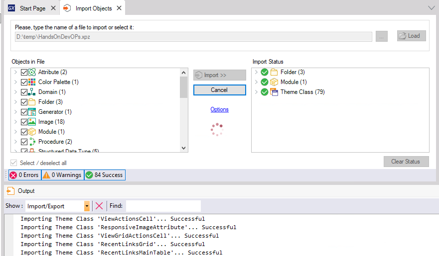

Caso não possua o Genexus 16, use a versão disponível e crie uma KB configurada para **.NET e SQL Server**.

Após a KB criada, criar uma Transação chamada Cliente com a seguinte estrutura.

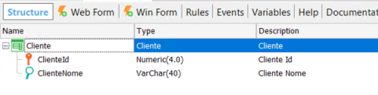

E aplicar o Pattern Work With para web na transação.

Após a importação / criação da transação dar um build All e criar a base de dados com o nome de **DemoDevOps**.

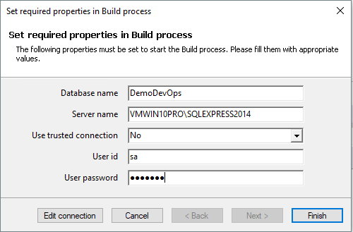

Executar a aplicação para verificar se a aplicação foi gerada de modo correto.

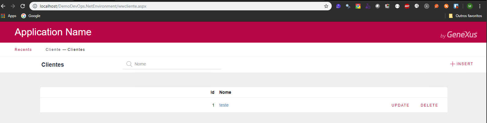

Agora vamos criar os pacotes de deploy, no menu Build do Genexus, clicar na opção **Export Reoganization**. Mais informações no link abaixo:

- [Export Reorganization](https://wiki.genexus.com/commwiki/servlet/wiki?34476,Export+Reorganization)

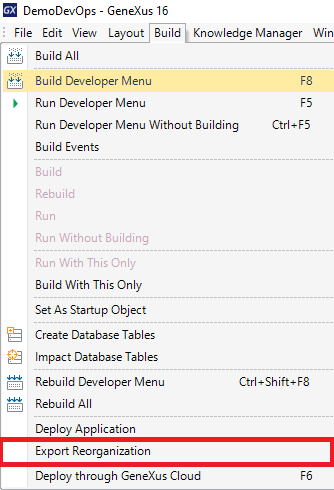

Marcar a opção Trusted Connection e clicar em **Zip It!**.

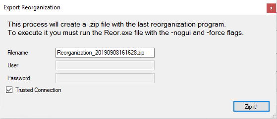

Será gerado um arquivo zip com os programas de reorganização.

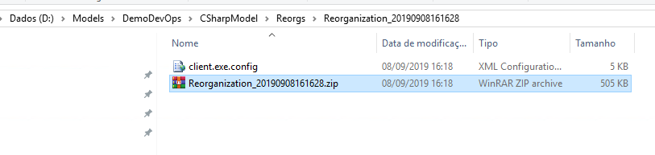

Agora vamos gerar o pacote de deploy da aplicação ASP.NET, no menu Build do Genexus, clicar na opção **Deploy Application**. Mais informações no link abaixo:

- [Application Deployment tool](https://wiki.genexus.com/commwiki/servlet/wiki?32092,Application+Deployment+tool)

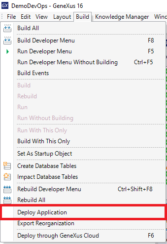

Selecionar o Main program **Home** e selecionar a opção **Microsoft IIS 8 (or higher)** no campo **Application Server**, e clicar em **Deploy**.

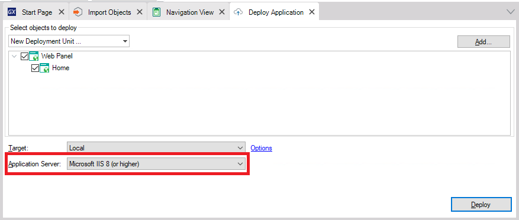

Será gerado um arquivo zip com os programas da aplicação.

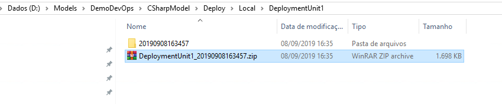

Conectar na VM do Azure usando o arquivo RDP, crie uma pasta temp no c:\ e copiar os arquivos de zip gerados.

### Configuração do ambiente

Vamos configurar as variáveis de ambiente para informar aos programas genexus os dados de conexão ao banco de dados. Mais informações sobre como o Genexus usa variáveis de ambiente no link abaixo:

- [Application Configuration using Environment Variables](https://wiki.genexus.com/commwiki/servlet/wiki?39459,Application+Configuration+using+Environment+Variables)

No Explorer, clicar com o botão direito do mouse no Computer e selecionar a opção **Properties**.

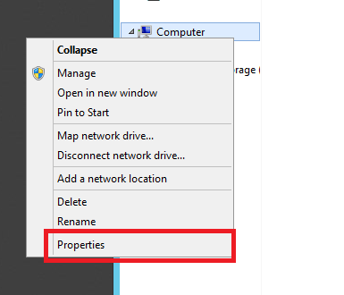

Clicar na opção **Advanced system settings**.

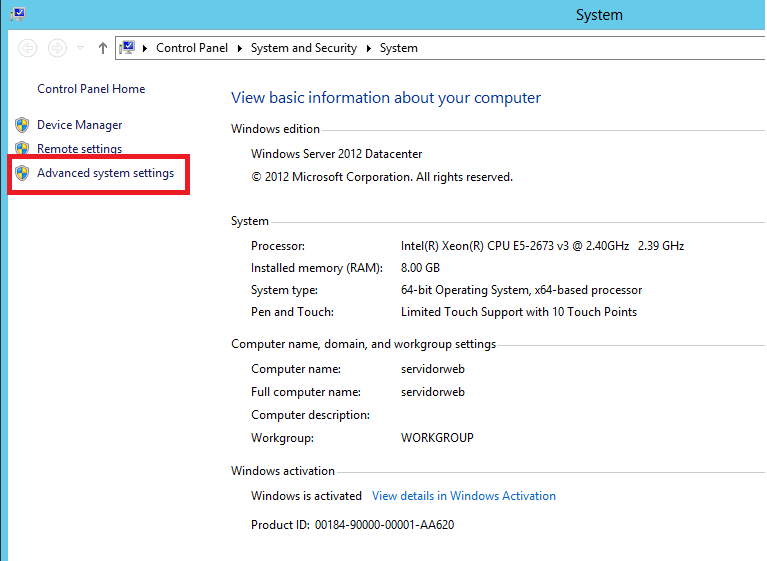

Clicar em **Environment Variables**.

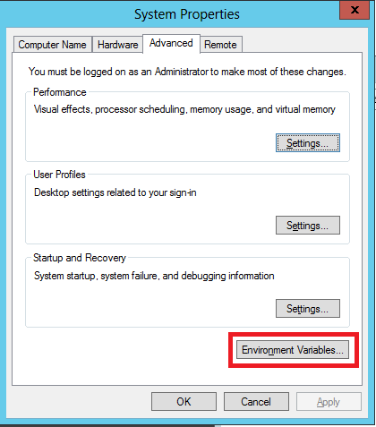

Vamos criar as varíaveis de ambiente clicando em **New** na seção **System Variables**.

Criar as seguintes variáveis

| Variável de ambiente | Valor |
| --- | --- |
| GX_Connection-Default-Datasource  | SERVIDORWEB\SQLEXPRESS  |
| GX_Connection-Default-User  | sa  |
| GX_Connection-Default-Password | sa!2016 |
| GX_Connection-Default-DB | DemoDevOps |

Vamos executar agora a reorganização da base de dados, descompacte o arquivo zip da reog.

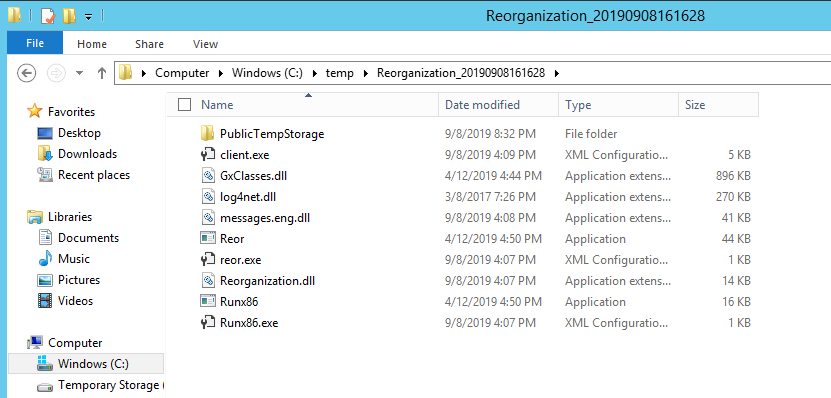

No Explorer digitar **cmd** para abrir um console de linha de comando.

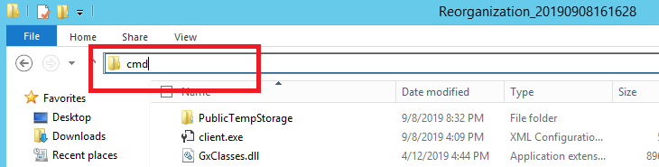

Na linha de comando digitar a seguinte instrução **reor.exe -nogui -force** para executar a reorganização da base de dados.

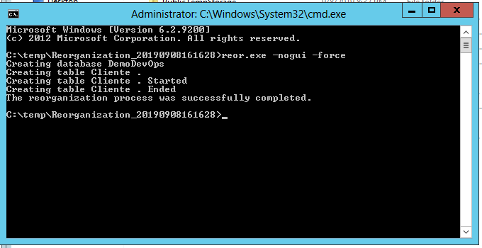

Com isso a base de dados foi criada.

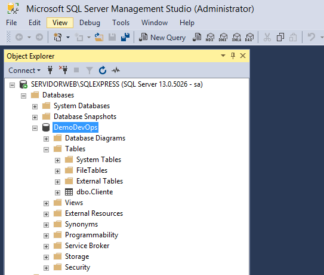

Agora vamos descompactar a aplicação web e copiar para dentro do IIS. Após descompactar o arquivo, selecione todos os arquivos de dentro da pasta, e copie para a pasta **C:\inetpub\wwwroot**.

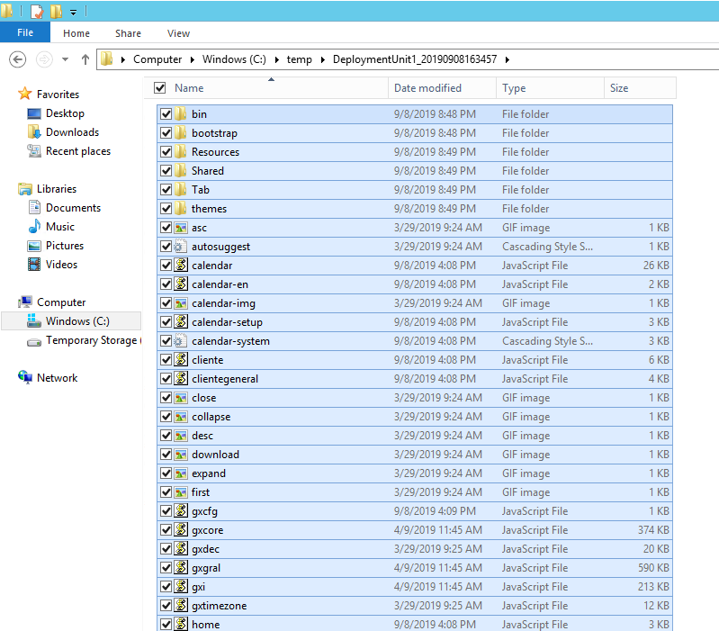

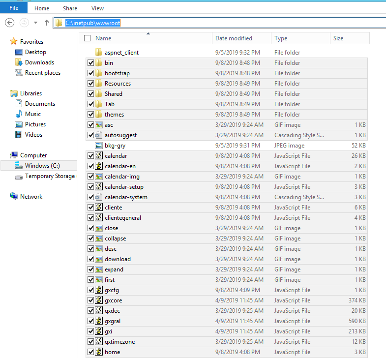

Reiniciar a VM para que o IIS reconheça as variáveis de ambiente que foram configuradas.

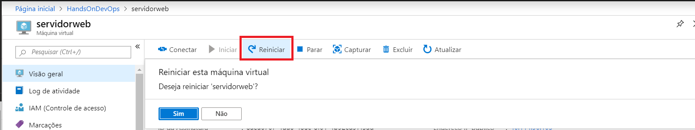

Após a reinicialização da VM, copie o IP público da VM.

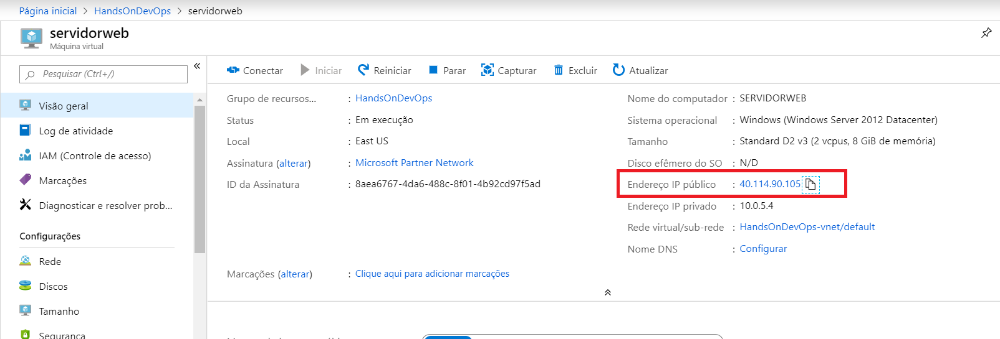

Abra um browser, cole no browser o IP e complete com o **/home.aspx**.

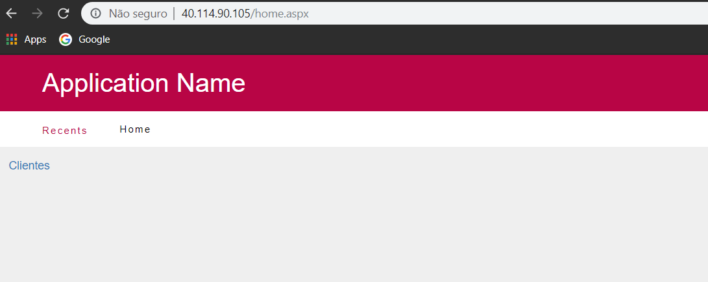

Navegue na aplicação, e crie um registro para verificar se a conexão com o SQL está OK.

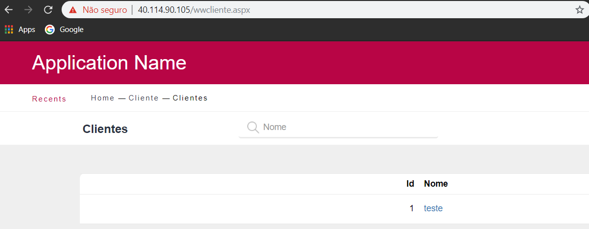

Próxima atividade: [Atividade 03](03-atividade.md)