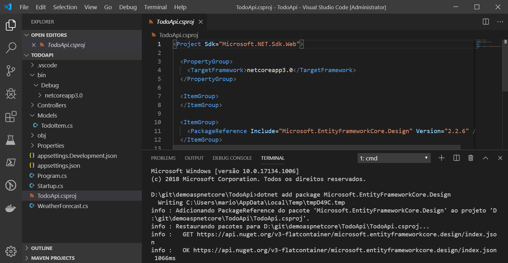

# Atividade 02 C - Gerando a aplicação ASP.NET Core

Nesta atividade vamos criar uma aplicação ASP.NET Core e instalar a aplicação gerada na VM no Azure.

#### Requisitos

- [Visual Studio Code](https://code.visualstudio.com/download)
- [.NET Core SDK 3.0](https://dotnet.microsoft.com/download/dotnet-core)
- [C# for Visual Studio Code](https://marketplace.visualstudio.com/items?itemName=ms-vscode.csharp)
- [SQL Server 2016 ou superior](https://www.microsoft.com/pt-BR/download/details.aspx?id=56840)

### Instalação do .NET Core 3.0

Vamos instalar as ferramentas do Entity Framework Core, para isso abra o **Prompt de Comando**, e digite o comando abaixo:

```bash
dotnet tool install --global dotnet-ef --version 3.0.0-* 
```


### Criação do Projeto ASP.NET Core

Criar uma pasta chamada **c:\git\demoaspnetcore** e abrir o **Prompt de Comando** e se posicionar na pasta.
Digita o comando **dotnet new webapi -o TodoApi** e teclar enter.
Após a criação do projeto, digitar code -r TodoApi para abrir o Visual Code.


Responda **Yes** para a pergunta do Visual Code sobre os ativos necessários.


Vamos executar a aplicação para testar, para isso pressione **CTRL+F5** para executar a aplicação.


Em um navegador, acesse a seguinte URL: **https://localhost:5001/WeatherForecast**.


Instalar a o pacote **Microsoft.EntityFrameworkCore.Design**, para isso, executar o comando abaixo no terminal do Visual Code:

```bash
dotnet add package Microsoft.EntityFrameworkCore.Design
```



Adicione uma pasta chamada **Models** na raiz do projeto.


Adicione uma arquivo chamado **TodoItem.cs** na pasta, com o seguinte código:

```csharp
namespace TodoApi.Models
{
    public class TodoItem
    {
        public long Id { get; set; }
        public string Name { get; set; }
        public bool IsComplete { get; set; }
    }
}
```


Agora é necessário registrar o contexto no banco de dados na injeção de dependência do ASP.NET Core.


- [Comandos do dotnet ef](https://docs.microsoft.com/en-us/ef/core/miscellaneous/cli/dotnet#common-options)

- [Atividade baseada no Tutorial: Criar uma API Web com o ASP.NET Core - Microsoft](https://docs.microsoft.com/pt-br/aspnet/core/tutorials/first-web-api?view=aspnetcore-2.2&tabs=visual-studio-code)

Próxima atividade: [Atividade 03](03-atividade.md)
