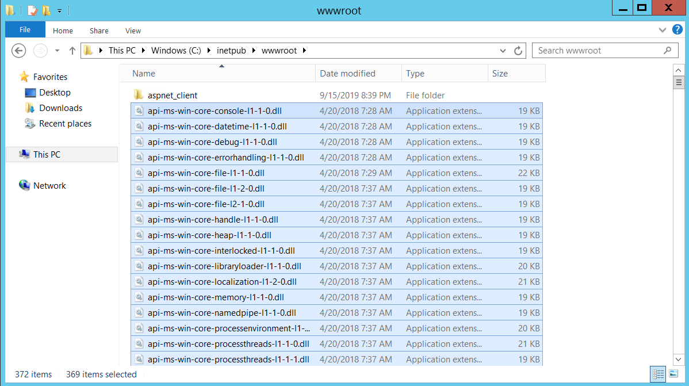
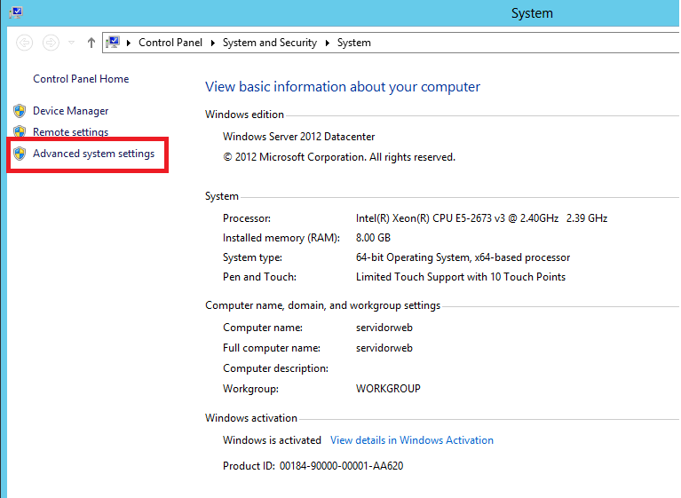
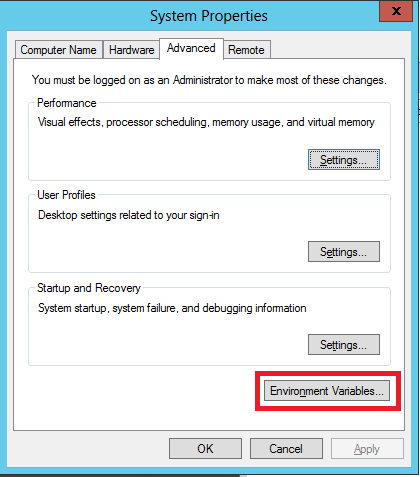
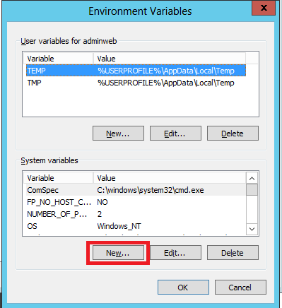
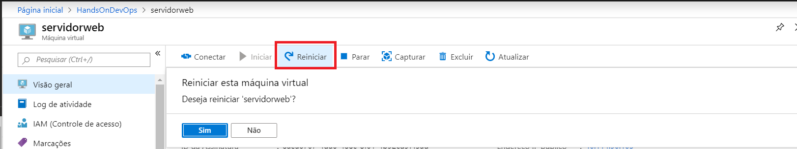

# Atividade 02 C - Gerando a aplicação ASP.NET Core

Nesta atividade vamos criar uma aplicação ASP.NET Core e instalar a aplicação gerada na VM no Azure.

#### Requisitos

- [Visual Studio Code](https://code.visualstudio.com/download)
- [.NET Core SDK 3.0](https://dotnet.microsoft.com/download/dotnet-core)
- [C# for Visual Studio Code](https://marketplace.visualstudio.com/items?itemName=ms-vscode.csharp)
- [SQL Server 2016 ou superior](https://www.microsoft.com/pt-BR/download/details.aspx?id=56840)

### Instalação do .NET Core 3.0

Vamos instalar as ferramentas do Entity Framework Core, para isso abra o **Prompt de Comando**, e digite o comando abaixo:

```bash
dotnet tool install --global dotnet-ef --version 3.0.0-rc1.19456.14
```


### Criação do Projeto ASP.NET Core

Criar uma pasta chamada **c:\git\demoaspnetcore** e abrir o **Prompt de Comando** e se posicionar na pasta.
Digita o comando **dotnet new webapi -o TodoApi** e teclar enter.
Após a criação do projeto, digitar code -r TodoApi para abrir o Visual Code.


Responda **Yes** para a pergunta do Visual Code sobre os ativos necessários.


Vamos executar a aplicação para testar, para isso pressione **CTRL+F5** para executar a aplicação.


Em um navegador, acesse a seguinte URL: **https://localhost:5001/WeatherForecast**.


Instalar a o pacote **Microsoft.EntityFrameworkCore.Design** e **Microsoft.EntityFrameworkCore.SqlServer**, para isso, executar o comando abaixo no terminal do Visual Code:

```bash
dotnet add package Microsoft.EntityFrameworkCore.Design --version 3.0.0-rc1.19456.14
dotnet add package Microsoft.EntityFrameworkCore.SqlServer --version 3.0.0-rc1.19456.14
```


Adicione uma pasta chamada **Models** na raiz do projeto.


Adicione uma arquivo chamado **TodoItem.cs** na pasta, com o seguinte código:

```csharp
namespace TodoApi.Models
{
    public class TodoItem
    {
        public long Id { get; set; }
        public string Name { get; set; }
        public bool IsComplete { get; set; }
    }
}
```


Vamos criar a classe do contexto do banco de dados, para isso, criar um arquivo chamado **TodoContext.cs** na pasta **Models**. E digitar o código abaixo:

```csharp
using Microsoft.EntityFrameworkCore;

namespace TodoApi.Models
{
    public class TodoContext : DbContext
    {
        public TodoContext(DbContextOptions<TodoContext> options)
            : base(options)
        {
        }

        public DbSet<TodoItem> TodoItems { get; set; }
    }
}
```


Editar o arquivo **appsettings.json** para acrescentar a string de conexão.


Agora é necessário registrar o contexto no banco de dados na injeção de dependência do ASP.NET Core, editar o arquivo Startup.cs incluir as biblitecas do **EF** e do **Models**, e configurar o dbcontext usando a string de conexão configurada anteriormente.


Agora criar o migrations, com o comando abaixo:

```bash
dotnet ef migrations add create -o migrations
```


Executar agora o migration para criar o banco de dados.

```bash
dotnet ef database update
```


Criar o arquivo **TodoController.cs** na pasta Controllers, com o código abaixo:

```csharp
using Microsoft.AspNetCore.Mvc;
using Microsoft.EntityFrameworkCore;
using System.Collections.Generic;
using System.Linq;
using System.Threading.Tasks;
using TodoApi.Models;

namespace TodoApi.Controllers
{
    [Route("api/[controller]")]
    [ApiController]
    public class TodoController : ControllerBase
    {
        private readonly TodoContext _context;

        public TodoController(TodoContext context)
        {
            _context = context;

            if (_context.TodoItems.Count() == 0)
            {
                // Create a new TodoItem if collection is empty,
                // which means you can't delete all TodoItems.
                _context.TodoItems.Add(new TodoItem { Name = "Item1" });
                _context.SaveChanges();
            }
        }

        // POST: api/Todo
        [HttpPost]
        public async Task<ActionResult<TodoItem>> PostTodoItem(TodoItem item)
        {
            _context.TodoItems.Add(item);
            await _context.SaveChangesAsync();

            return CreatedAtAction(nameof(GetTodoItem), new { id = item.Id }, item);
        }

        // GET: api/Todo
        [HttpGet]
        public async Task<ActionResult<IEnumerable<TodoItem>>> GetTodoItems()
        {
            return await _context.TodoItems.ToListAsync();
        }

        // GET: api/Todo/5
        [HttpGet("{id}")]
        public async Task<ActionResult<TodoItem>> GetTodoItem(long id)
        {
            var todoItem = await _context.TodoItems.FindAsync(id);

            if (todoItem == null)
            {
                return NotFound();
            }

            return todoItem;
        }

        // PUT: api/Todo/5
        [HttpPut("{id}")]
        public async Task<IActionResult> PutTodoItem(long id, TodoItem item)
        {
            if (id != item.Id)
            {
                return BadRequest();
            }

            _context.Entry(item).State = EntityState.Modified;
            await _context.SaveChangesAsync();

            return NoContent();
        }
    }
}
```


Executar a webapi pressionando **CTRL+F5**.


No browser digitar a url **https://localhost:5001/api/todo**.


Vamos alterar o projeto para que seja possível a aplicação pegar a string de conexão de variáveis de ambiente. Editar o arquivo **Startup.cs** e alterar o método **Startup** como o código abaixo:

```csharp
        public Startup()
        {
            var builder = new ConfigurationBuilder()
                .AddJsonFile("appsettings.json");
            builder.AddEnvironmentVariables();
            Configuration = builder.Build();
        }
```

Vamos criar o script do migrations, para isso execute o comando abaixo no terminal do VS Code:

```bash
dotnet ef migrations script 0 create -o create.sql
```

Será criado um arquivo **create.sql** na raiz do projeto.


Agora vamos gerar o pacote que com todas as dependências para publicarmos na VM do Azure, para isso execute o comando abaixo no terminal do VS Code:

```bash
dotnet publish -c Release --self-contained --runtime win10-x64
```


Na pasta **bin\Release\netcoreapp3.0\win10-x64** estão os arquivos para publicação, zipar a pasta.


### Configuração do ambiente

Conectar na VM do Azure usando o arquivo RDP, crie uma pasta temp no c:\ e copiar o arquivo zip e o script **create.sql**.


Vamos criar a base de dados executando o script no SQL Management, inicialmente criar uma base de dados chamada **ToDo**, e executar o script **create.sql** contra esse base.


Na VM abrir um broser e acessar a url **https://dotnet.microsoft.com/download/dotnet-core/3.0** para fazer o download Hosting Bundle do .NET Core.


Executar o arquivo **dotnet-hosting-3.0.0-rc1.19457.4-win**.


Reinicie o servidor. Após o boot, conecte novamente na VM e abra o IIS Manager, e clique com o botão da direito do mouse no **Default Web Site** e clique em **Remove**.


Clicar com o botão direito do mouse em **Sites** e clicar em **Add WebSite**. Preencher o campo **Site Name** com **aspnetcore** e o campo **Physical path** com **C:\inetpub\wwwroot**.


Clicar em **Application Poll** e clicar com o botão direito do mouse no item **aspnetcore** e clicar no item **Basic Settings**.


Selecionar o item **No Managed Code** no combo **.NET CLR version** e clicar em OK.


Descompactar o zip e copiar os arquivos para a pasta **c:\inetpub\wwwroot**.



No Explorer, clicar com o botão direito do mouse no Computer e selecionar a opção **Properties**.


Clicar na opção **Advanced system settings**.



Clicar em **Environment Variables**.



Vamos criar as varíaveis de ambiente clicando em **New** na seção **System Variables**.



Criar a seguinte variável:

| Variável de ambiente | Valor |
| --- | --- |
| ConnectionString__TodoDB  | server=.\SQLEXPRESS;database=TodoDB;User ID=sa;password=sa!2016;  |


Reiniciar a VM para que o IIS reconheça as variáveis de ambiente que foram configuradas.



Copie o IP público da VM do portal do Azure e digite a url **http://{IP Público}/api/todo** para testar a API. 


- [Comandos do dotnet ef](https://docs.microsoft.com/en-us/ef/core/miscellaneous/cli/dotnet#common-options)

- [Atividade baseada no Tutorial: Criar uma API Web com o ASP.NET Core - Microsoft](https://docs.microsoft.com/pt-br/aspnet/core/tutorials/first-web-api?view=aspnetcore-2.2&tabs=visual-studio-code)

- [EF Core & ASP.NET Core: Read Connections Strings & Config Values from Environment Variables](https://www.benday.com/2017/12/20/ef-core-asp-net-core-read-connections-strings-from-environment-variables/)

Próxima atividade: [Atividade 03](03-atividade.md)
