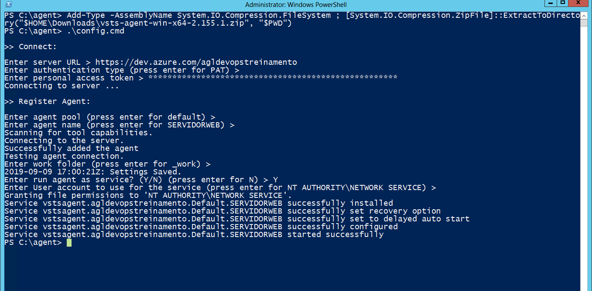

# Atividade 03

Nesta atividade vamos configurar o Agente do Azure DevOps na VM no Azure.

### Instalação do Agente do Azure DevOps

Para a instalação do Agente do DevOps vamos seguir a documentação do Azure DevOps.

Abra o browser na VM do Azure e conecte na instância do azure DevOps e siga os passos do link abaixo.

- [Instruções para instalação do agente do DevOps](https://docs.microsoft.com/en-us/azure/devops/pipelines/agents/v2-windows?view=azure-devops)

Vamos instalar o agente como serviço, então será executado o comando **.\config.cmd**.

Responda a pergunta **Enter run agent as service? (Y/N)** com **Y** para que o agente seja executado como serviço no Windows.

Para instalações on-premise será necessário configurar o firewall, siga as indicações do link abaixo.

- [Configuração do firewall](https://docs.microsoft.com/en-us/azure/devops/pipelines/agents/v2-windows?view=azure-devops#im-running-a-firewall-and-my-code-is-in-azure-repos-what-urls-does-the-agent-need-to-communicate-with)

Próxima atividade: [Atividade 04](04-atividade.md)