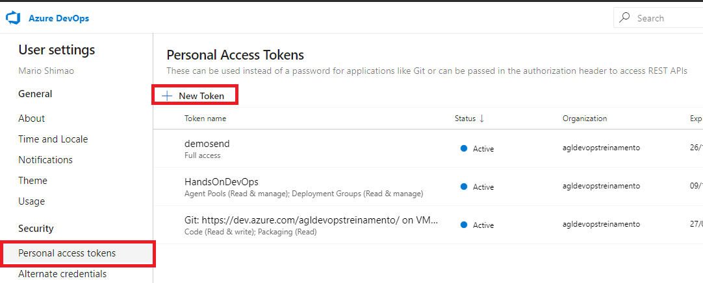
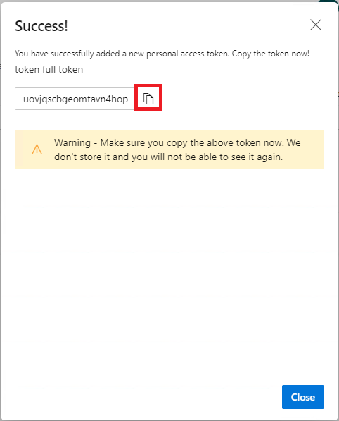

# Atividade 04c

Nesta atividade vamos subir o projeto ASP.NET Core para o Azure Repos usando o Git for Windows.

### Instalação do Git for Windows

Usaremos o Git for Windows para interagirmos com o Azure Repos, acesse o link abaixo para realizar o download. 

- [Download do Git for Windows](https://git-scm.com/download/win)

Após a instalação do Git, vamos usá-lo para iniciar um repositório no diretório da projeto ASP.NET Core. Para isso abra o Git CMD.


Vamos criar um novo repositório, para isso usando o Git CMD, ir até o diretório do ASP.NET Core. Posicionado no diretório, vamos digitar o comando **git init** para inicializar o repositório Git.


Crie um arquivo chamado **.gitignore** no diretório do projeto.


Digite o seguinte conteúdo: 

```bash
*.swp
*.*~
project.lock.json
.DS_Store
*.pyc

# Visual Studio Code
.vscode

# User-specific files
*.suo
*.user
*.userosscache
*.sln.docstates

# Build results
[Dd]ebug/
[Dd]ebugPublic/
[Rr]elease/
[Rr]eleases/
x64/
x86/
build/
bld/
[Bb]in/
[Oo]bj/
msbuild.log
msbuild.err
msbuild.wrn
```

Essas linhas vão fazer com que os arquivos com extensão são gerados pelo processo de compilação sejam ignorados pelo Git e não sejam armazenados.

- [Mais informações gitignore](https://git-scm.com/docs/gitignore)

Vamos adicionar os arquivos ao repositório usando o comando:

```bash
git add . 
```


Vamos executar o comando commit para que os arquivos sejam armazenados no repositório.

```bash
git commit -m 'inicio'
```


Neste momento os arquivos estão armazenados no repositório local, agora vamos conectar com o Azure Repos e enviar os arquivos para lá. Para isso acesse a instância do Azure DevOps criada anteriormente.


Agora vamos criar o token de autenticação para que o Git acesse o Azure Repos. Para isso, clicar no icone do avatar no canto superior direito e na opção **Azure DevOps profile**.


Clicar na opção **Personal access tokens** e depois em **New Token**.



Informar no campo **Name** o valor **token full** e selecionar o item **Full access** e clicar em **Create**.


Copie o token e cole num arquivo texto para ser utilizado posteriormente, e feche a tela.



Clicar no icone do Azure DevOps no canto superior esquerdo da tela para retornar a tela inicial.

Clicar no botão **+ New project** para criar um novo projeto. No campo **Project Name** digite **HandsOnDevOpsNETCore** e cliquem em **Create**.


Clicar na opção **Repos**, e copiar os comandos da seção **or push an existing repository from command line**.


E cole os comandos na janela do Git CMD, e informe no campo senha cole o token gerado anteriormente.


Atualize a tela do browser, e verá que os arquivos agora estão no repositório do Azure.


- [Mais informações sobre o Git](https://git-scm.com/doc)

Próxima atividade: [Atividade 05](05-atividade.md)