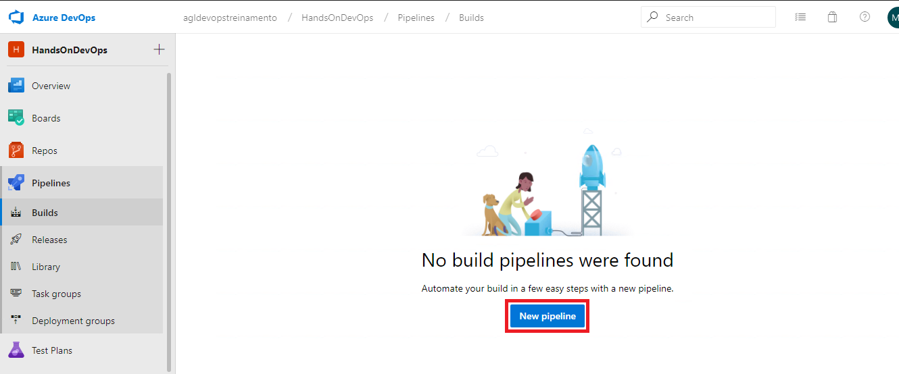
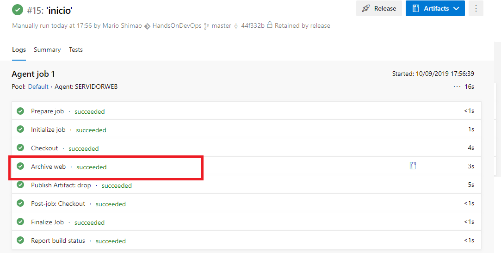

# Atividade 05

Nesta atividade iremos configurar um pipeline de build para gerar os artefatos que serão utilizados para o deploy.

### Pipeline Build

Criaremos um pipeline que buscará os arquivos no repositório do Azure Repos, fará a geração de um arquivo zip e subir o arquivo como artefato para o Azure Pipeline.

Acessar o Azure DevOps e abrir o projeto HandsOnDevOps. Clicar na opção **Pipelines**, clicar em **Builds** e depois na opção **New pipeline**.

Clicar em **Use the classic editor**, a opção usando o editor clássico é mais amigável, no entanto será importante para implementações mais elaboradas a utilização da configuração utilizando YAML.

Selecione o **Azure Repos Git** como source, deixe os valores padrões selecionados e clique em **Continue**.

Clicar em **Empty job**.

Selecionar o pool **Default** na opção **Agent pool**.

Adicionar uma task no item do **Agent job 1** clicando no sinal de **+**.
No campo de pesquisa digitar **zip** para que as task de compressão sejam pesquisadas.
Selecionar o item **Archive files** clicando nele.

Confirmar a seleção clicando em **Add**.

Editar as propriedades.

| Campo | Valor | 
| --- | --- |
| Display name | Archive web |
| Root folder or file to archive | web |
| Archive file to create | $(Build.ArtifactStagingDirectory)/web.zip |

E setar o checkbox da propriedade **Force verbose output** para podermos visualizar a execução do comando.

O Azure Pipelines tem uma lista de variáveis pre definidas que podem ser usadas nas tarefas de build e release. Neste caso estamos usando a variável **$(Build.ArtifactStagingDirectory)** para identificar o diretório local onde o agente procura os artefatos a serem publicados.

- [Lista de variáveis pre definidas do Azure DevOps](https://docs.microsoft.com/en-us/azure/devops/pipelines/build/variables?view=azure-devops&viewFallbackFrom=azure-devop&tabs=yaml)

Adicionar agora a task que irá subir o artefato para o Azure Pipelines, clicar no sinal de **+** do item **Agent Job 1**.
Digitar **publish** no campo de pesquisa e selecionar o item **Publish build artifacts**. E clicarm em **Add** para confirmar.

Não é necessário fazer nenhuma configuração nessa tarefa, pois ela irá pegar o arquivo gerado no diretório **$(Build.ArtifactStagingDirectory)** e subir para o Azure Pipelines.

Agora vamos salvar e executar o build, para clique em **Save & queue**. E confirme na tela seguinte clicando em **Save and run**.

O Azure Pipelines irá mostrar o log de processamento e o resultado. Clicando em **Artifacts** podemos realizar o download do arquivo **web.zip**.

Para ver o log detalhado de um item, clicar no item.

Vamos habilitar a integração contínua para que quando um push for realizado no Azure Repos configurado no Pipeline de Build, o pipeline de build será executado automaticamente.
Clicar na opção **Trigger**.

Selecionar o checkbox **Enable continuous integration**.

E salvar o pipeline.

Próxima atividade: [Atividade 06](06-atividade.md)