# Atividade 05 - Build do projeto ASP.NET Core

Nesta atividade iremos configurar um pipeline de build para gerar os artefatos que serão utilizados para o deploy.

### Pipeline Build

Criaremos um pipeline que buscará os arquivos no repositório do Azure Repos, fará a geração de um arquivo zip e subir o arquivo como artefato para o Azure Pipeline.

Acessar o Azure DevOps e abrir o projeto HandsOnDevOpsNETCore. Clicar na opção **Pipelines**, clicar em **Builds** e depois na opção **New pipeline**.

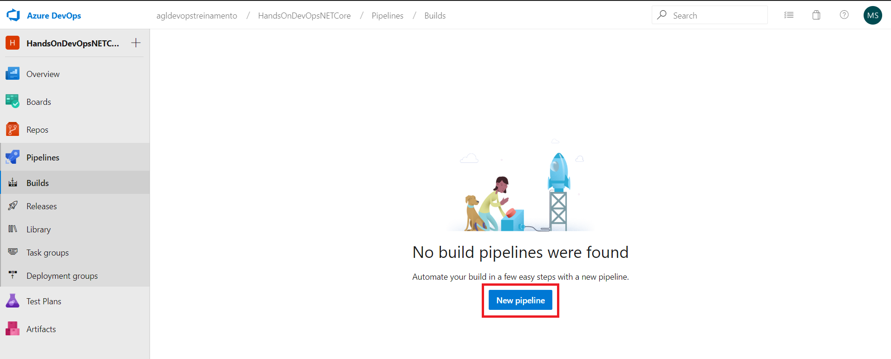

Clicar em **Azure Repos Git YAML**.

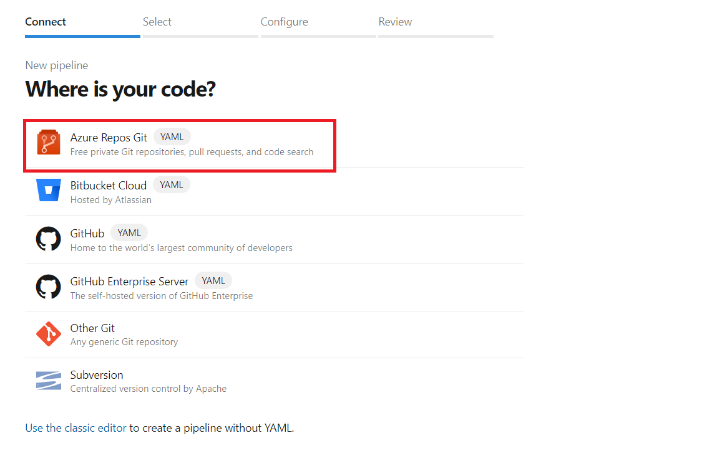

Clique em **HandsOnDevOpsNETCore**.

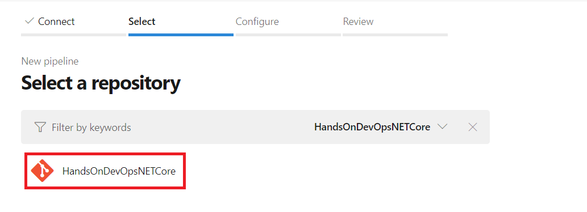

Clique em **Show more**.

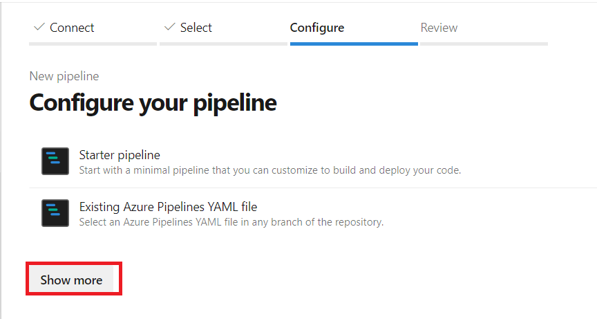

Selecionar o item **ASP.NET Core**.

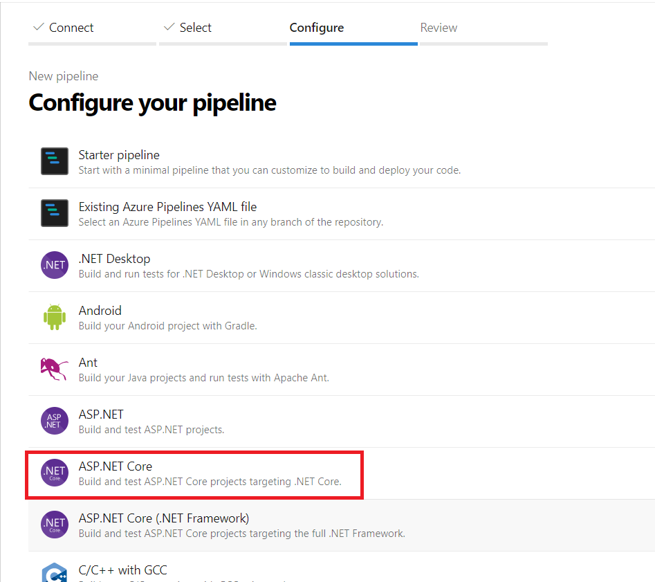

Clicar em **Save and run**.

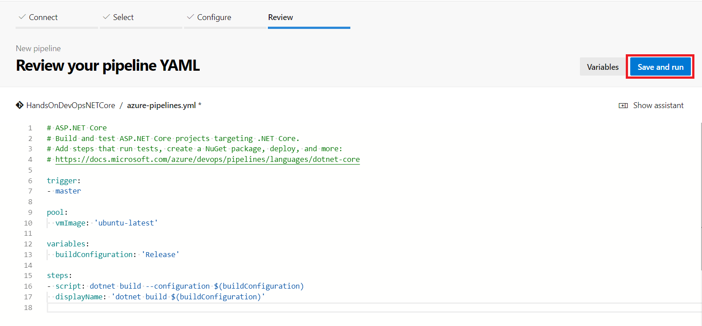

Deixar o item **Commit directly to the master branch.** selecionado e clicar novamente em **Save and run**.

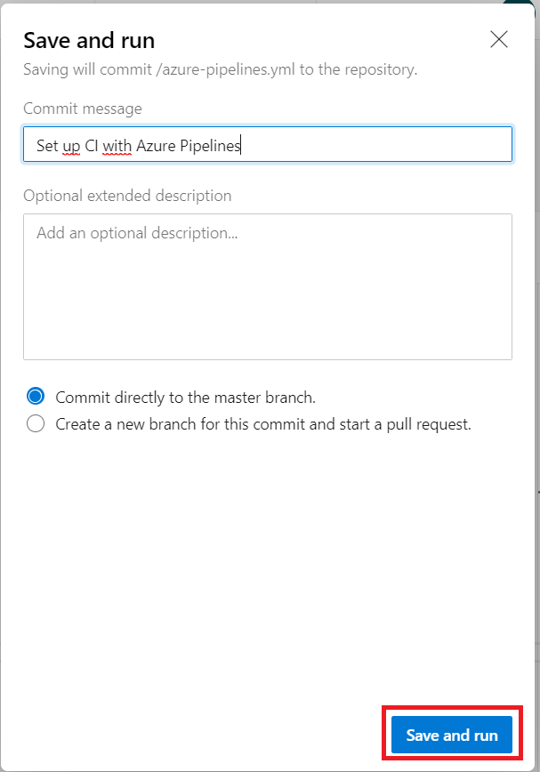

O processamento irá gerar um erro devido ao fato da ausência do SDK .NET Core compatível com o projeto.

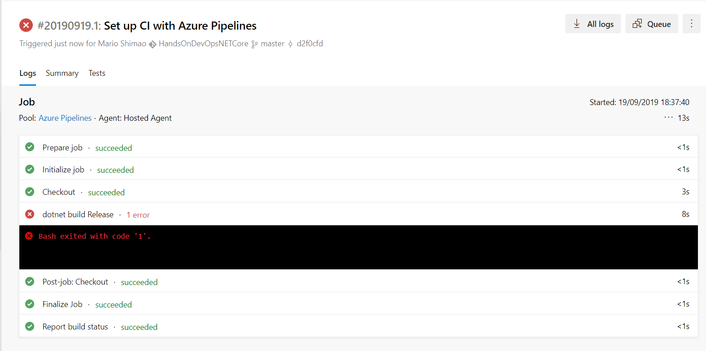

Clicar no item **Builds** do menu lateral e clicar em **Edit**.

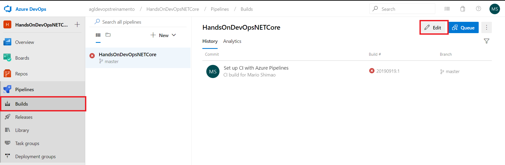

No campo de pesquisa digitar **Use .NET** e selecione o item **Use .NET Core**.

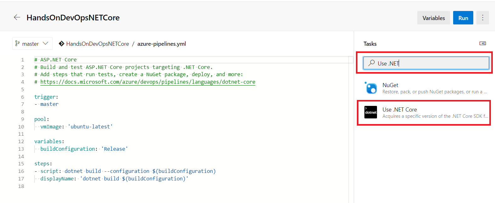

No campo **Version** informar **3.0.100-rc1-014190**, acrescente linhas abaixo do texto **steps**, posicione o cursor como na imagem e clicar me **Add**.

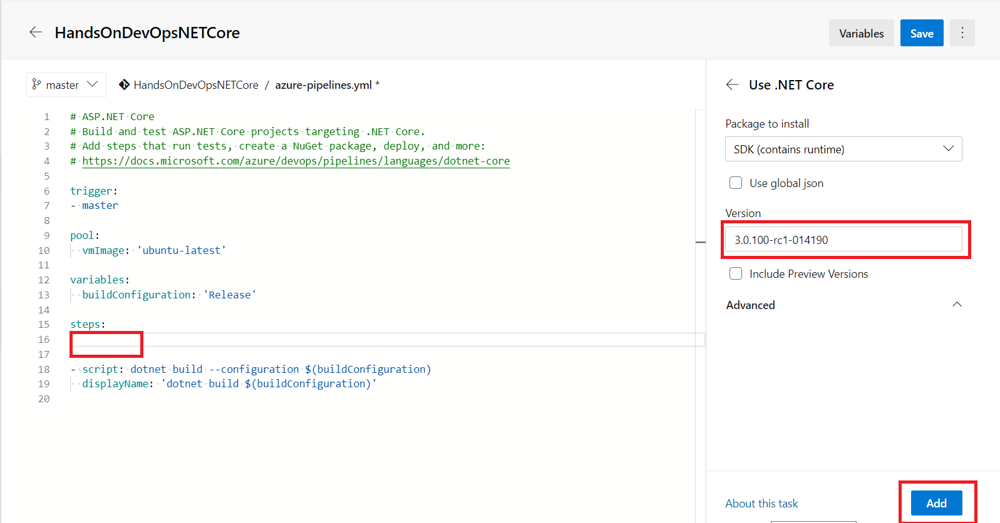

Clicar em **Save** e novamente em **Save** na próxima tela.

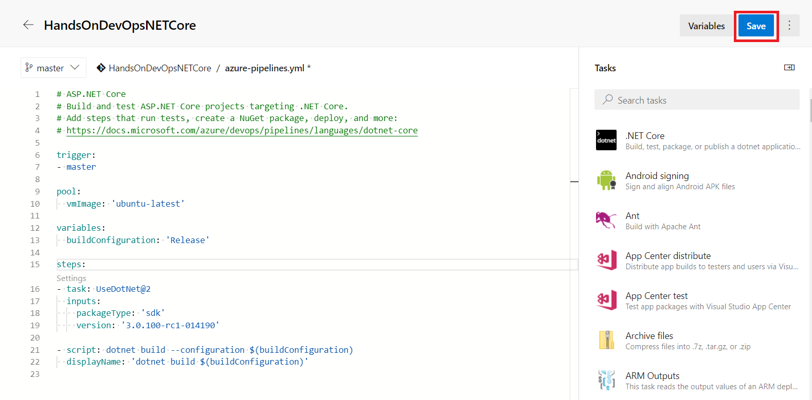

Como a trigger de push de codigo está ativo, o build vai ser disparado ao salvar o a configuração do pipeline. Clicar em **Builds** e depois no pipeline para ver os detalhes.

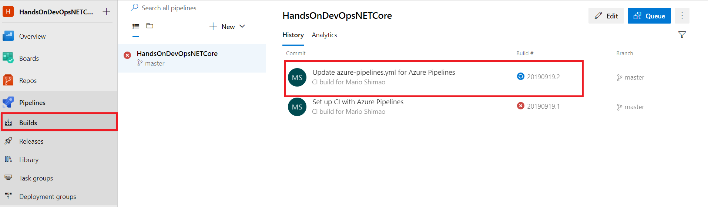

Clique em **Summary**.

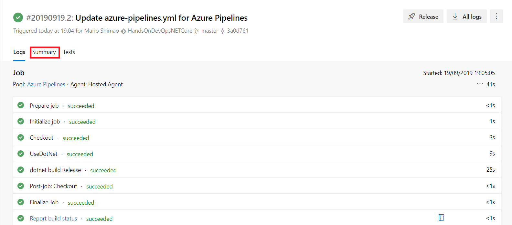

Veja que nenhum artefato foi gerado pelo Build, isso ocorreu porque está faltando uma tarefa após o build para fazer upload dos artefatos gerados. 

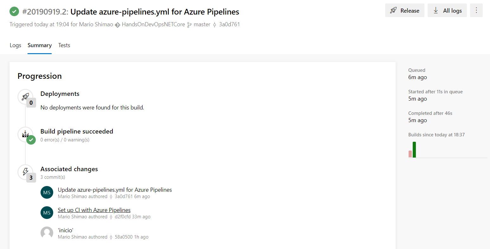

Clique em **Builds** e depois em **Edit** para abrirmos o pipeline para edição, vamos incluir uma task para realizar o publish do .NET Core e gerar um zip, e a uma task para fazer o upload do zip gerado.
Adicionar o código abaixo no final do pipeline e salvar o yaml.

```yaml
- task: DotNetCoreCLI@2
  inputs:
    command: 'publish'
    publishWebProjects: true
    arguments: '--configuration $(BuildConfiguration) --output $(Build.ArtifactStagingDirectory) --self-contained --runtime win10-x64'
    zipAfterPublish: True

- task: PublishBuildArtifacts@1
  inputs:
    PathtoPublish: '$(Build.ArtifactStagingDirectory)'
    ArtifactName: 'drop'
    publishLocation: 'Container'
```

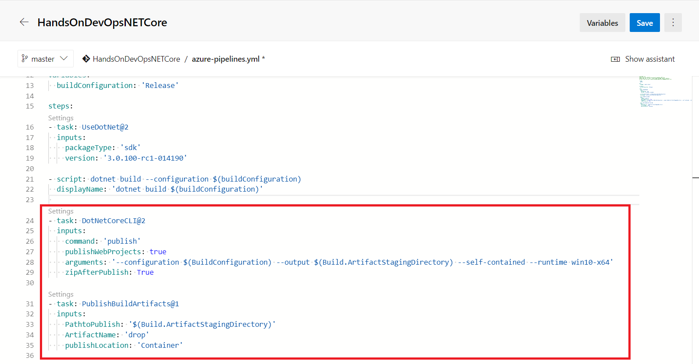

Clicar em **Builds** e no item em execução para acompanhar o build. No final do processo será possível verificar que desta vez o artefato foi gerado.

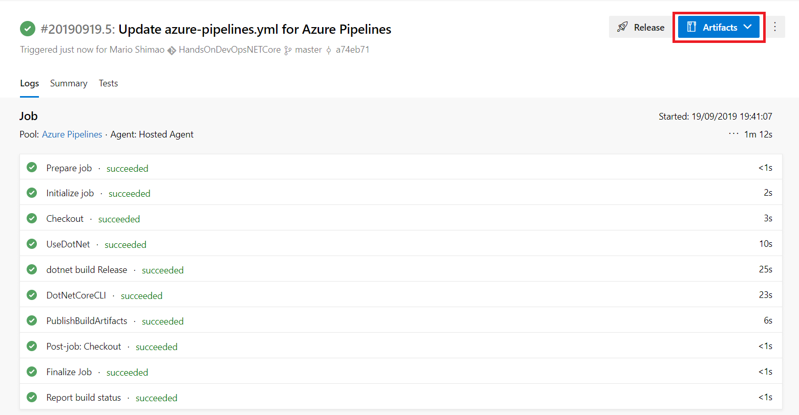

Clique em **Artifacts** e clique em **Drop** para realizar o download do zip, e veja que os arquivos da aplicação estão dentro do zip.

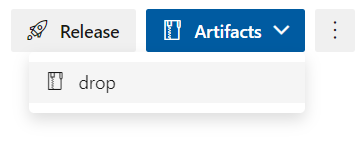

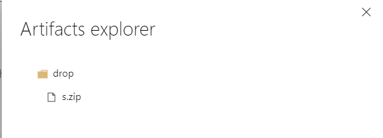

Próxima atividade: [Atividade 06](06-atividade.md)