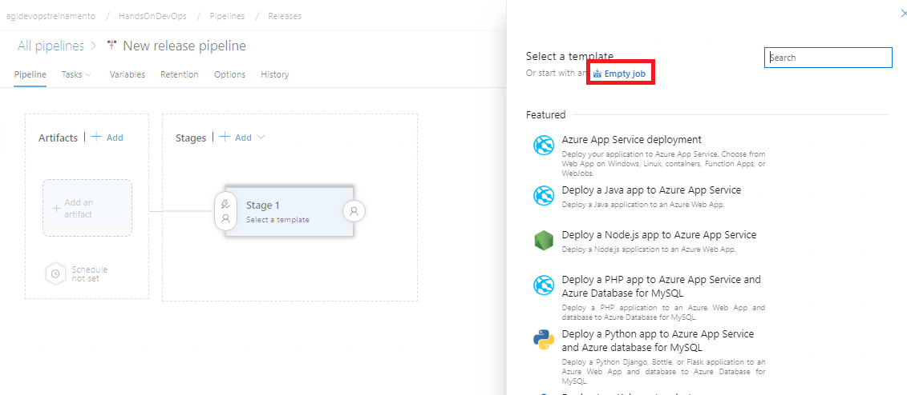

# Atividade 06

Nesta atividade iremos configurar um pipeline de release para implantar os programas Genexus.

### Pipeline Release

Criaremos um pipeline que buscará o artefato no Azure Pipeline, fará a extração do arquivo zip e cópia para o diretório do IIS.

Acessar o Azure DevOps e abrir o projeto HandsOnDevOps. Clicar na opção **Pipelines**, depois na opção **Releases** e depois na opção **New pipeline**.

Clicar na opção **Empty job**.

Preencher o campo **Stage name** com **QA**.

Clicar no texto **New release pipeline**, apagar o texto e digitar **Deploy QA**.

Clicar em **Save** para salvar. Depois clicar no texto **+ Add** do box **Artifacts** para selecionar o artefato que será utilizado para a implantação.

Selecione **Build** como **Source type**, configure as seguintes propridades e cliquem em **Add**.

| Campo | Valor | 
| --- | --- |
| Project | HandsOnDevOps |
| Source (build pipeline) | HandsOnDevOps-CI |
| Default version | Latest |
| Source alias | _HandsOnDevOps-CI |

Clique no ícone de raio no box **Artifacts**.

Habilitar o trigger para habilitar o deploy contínuo, dessa forma toda vez que um build terminar com sucesso, o deploy será realizado em seguida. Clicar no **X** para fechar a janela.

Clicar no texto **1 job, 0 task** para abrir a tela de configuração das tasks.

Clicar no item **Agent job** e alterar o Agent pool para **Default**, com isso será usado o agente instalado anteriormente para execução do deploy.

Clicar no **+** do item **Agent job**, digitar **extract** no campo de pesquisa, selecionar o item **Extract files** e clicar em **Add**.

Clicar no item **Extract files** e editar as seguintes propriedades.

| Campo | Valor | 
| --- | --- |
| Display name | Extract files web |
| Archive file patterns | $(System.DefaultWorkingDirectory)/_HandsOnDevOps-CI/drop/web.zip |
| Destination folder | $(Agent.WorkFolder)/webzip |

Nessa tarefa estamos descompactando o arquivo web.zip que foi baixado do Azure Pipelines para a VM do agente no diretório **_HandsOnDevOps-CI/drop**  e vai ser descompactado no diretório **webzip**.

Clicar no **+** do item **Agent job**, digitar **copy** no campo de pesquisa, selecionar o item **Copy files** e clicar em **Add**.

Clicar no item **Copy files** e editar as seguintes propriedades.

| Campo | Valor | 
| --- | --- |
| Display name | Copy Files web |
| Source Folder | $(Agent.WorkFolder)/webzip/web |
| Contents | ** |
| Target Folder | c:\inetpub\wwwroot |

Marcar a opção **Overwrite**.

Clicar em **Save** para salvar o pipeline.

Vamos configurar os direitos do usuário do agente para que ele possa copiar os arquivos, para isso vamos conectar na VM. 
Abrir o Explorer e clicar no botão direito na pasta c:\inetpub\wwwroot, e clicar em **Properties**.

Clicar na aba **Security** e clicar em **Edit**.

Clicar em **Add**.

Clicar em **Advanced**.

Clicar em **Find Now** e ir até o final da lista e selecionar o item **VSTS_Agent...**.

Clicar em **OK** para confirmar a seleção do usuário.

Marcar o item **Full control** e clicar me **OK**. E **OK** na próxima tela.

Abrir o Azure Pipelines, clicar em **Create release**.

Clicar em **Create**.

Clicar em **Release-1**.

Podemos ver o log clicando no texto **Succeeded**.

Próxima atividade: [Atividade 07](07-atividade.md)

