# Atividade 07 - Executando alterações na base de dados 

Nesta atividade iremos configurar os pipelines de build e de release para executar os scripts de reorganização do Genexus.

### Tabela de Controle

Para controlar a execução dos scripts sql iremos criar uma tabela de controle na base de dados da aplicação. Conecte na VM e abra o SQL Server Management Studio e execute o script abaixo para criar a tabela na base de dados.

```sql 
SET ANSI_NULLS ON
GO

SET QUOTED_IDENTIFIER ON
GO

SET ANSI_PADDING ON
GO

CREATE TABLE [dbo].[AzureDevOpsMigration]
(
                [Id] [int] IDENTITY(1,1) NOT NULL,
                [DataCriacao] [datetime] NOT NULL CONSTRAINT [DF_AzureDevOpsMigration_DataCriacao]  DEFAULT (getdate()),
                [DataExecucao] [datetime] NULL,
                [NomeArquivo] [varchar](100) NOT NULL,
                [ScriptSQL] [varchar](max) NOT NULL,
                CONSTRAINT [PK_AzureDevOpsMigration] PRIMARY KEY CLUSTERED 
(
                [Id] ASC
)WITH (PAD_INDEX = OFF, STATISTICS_NORECOMPUTE = OFF, IGNORE_DUP_KEY = OFF, ALLOW_ROW_LOCKS = ON, ALLOW_PAGE_LOCKS = ON) ON [PRIMARY]
) ON [PRIMARY] TEXTIMAGE_ON [PRIMARY]

GO

SET ANSI_PADDING OFF
GO

```

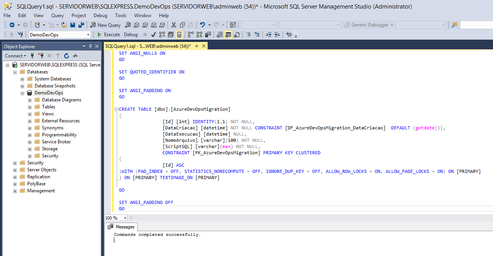

Criar uma pasta chamada **scriptsql** na pasta do environment do .NET. Nesta pasta iremos armazenar os scripts sql que serão executados pelo Azure Pipeline.


Agora vamos criar mais um atributo na transação cliente, para gerarmos uma reorganização no Genexus. Abra a transação Cliente, e crie um atributo chamado ClienteSobrenome Varchar(40), e salve a alteração.


Impactar as tabelas para gerar a reorganização.

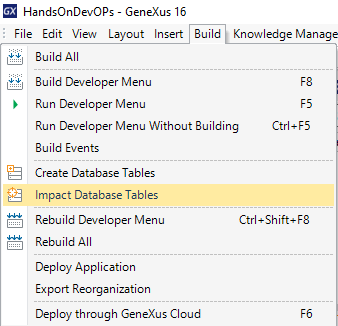

Copiar as instruções SQL geradas e criar um arquivo chamado **addcoluna.sql**. Salvar esse arquivo na pasta **scriptsql**.


Abra o Git CMD e se posicione no diretório do environment .NET.


Executar o comando add para marcar os arquivos para serem armazenados.

```bash
git add *.*
```

Vamos executar o comando commit para que os arquivos sejam armazenados no repositório.

```bash
git commit -a -m 'script'
```


Executar o comando push para subir os arquivos para o repositório do Azure Repos.

```bash
git push origin master
```


Acesse o Azure Repos para verificar se a pasta scriptsql e o arquivo addcoluna.sql está lá.

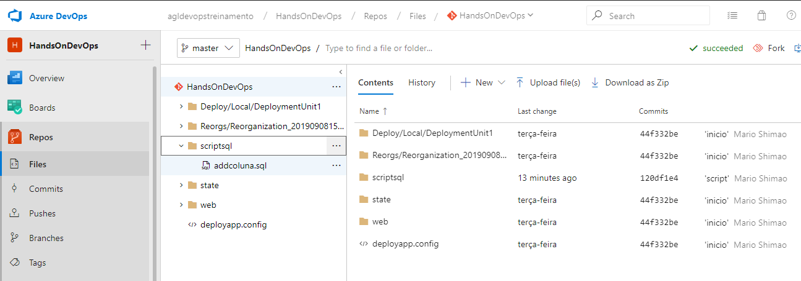

Agora vamos alterar o Pipeline de Build para pegar o arquivo sql e transformar num artefato para o Pipeline de Release.
Clique no item **Builds** para listar os pipelines. Clicar na opção **Edit** para abrir o pipeline para edição.


Clicar no **+** no item **Agent job 1**. Preencher o campo de pesquisa com **Archive** e selecinar o item **Archive files** e clique em **Add**.

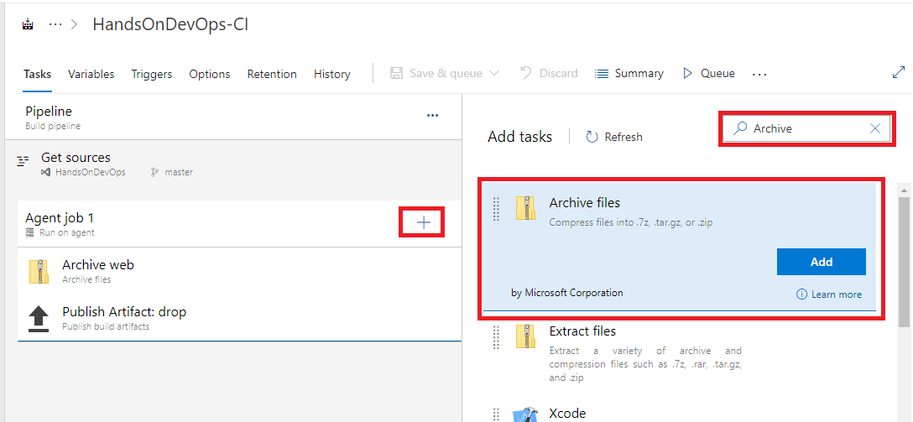

Editar as propriedades.

| Campo | Valor | 
| --- | --- |
| Display name | Archive scriptsql |
| Root folder or file to archive | scriptsql |
| Archive file to create | $(Build.ArtifactStagingDirectory)/scriptsql.zip |

E setar o checkbox da propriedade **Force verbose output** para podermos visualizar a execução do comando.

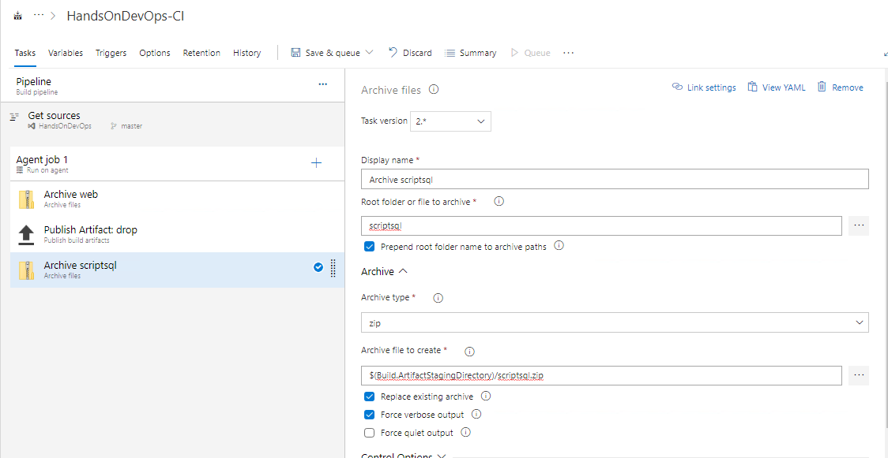

Arrastar o item **Archive scriptsql** para cima do **Publish Artifact: drop**.


Vamos salvar o pipeline e executá-lo clicando em **Save & queue**.

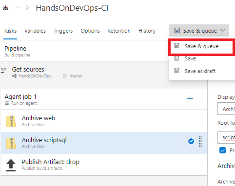

Após o pipeline executar, clicar no item **Summary**, e no item **drop**, clicar no texto **...**, e depois em **View contents** para verificar se o artefato do script sql foi gerado.


Agora vamos editar o pipeline de release para executar o script SQL. Clicar em **Release** e na opção **Edit**.


Vamos editar o stage, e adicionar as tasks para executar o script SQL. Para isso, clicar no item **1 job, 2 tasks**. 

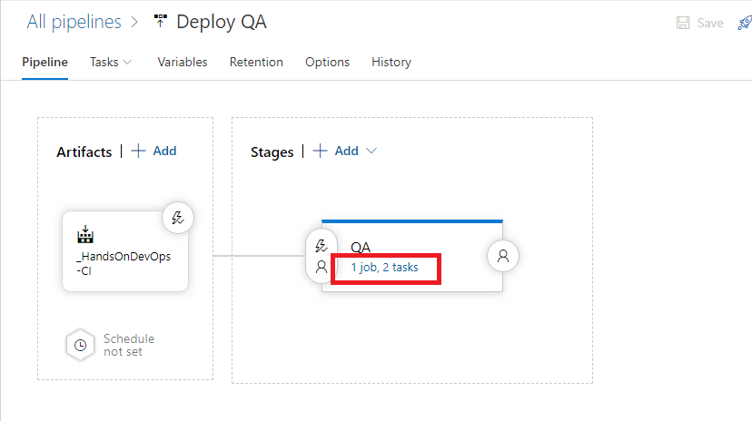

Clicar no **+** do item **Agent job**, digitar **extract** no campo de pesquisa e selecinar o item **Extract Files** e clicar em **Add**.

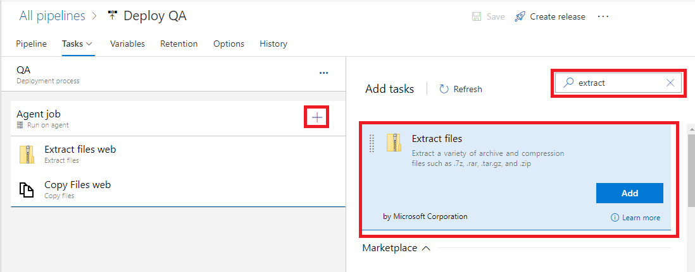

Clicar no item **Extract files** e editar as seguintes propriedades.

| Campo | Valor | 
| --- | --- |
| Display name | Extract files scriptsql |
| Archive file patterns | $(System.DefaultWorkingDirectory)/_HandsOnDevOps-CI/drop/scriptsql.zip |
| Destination folder | $(Agent.WorkFolder)/scriptsqlzip |

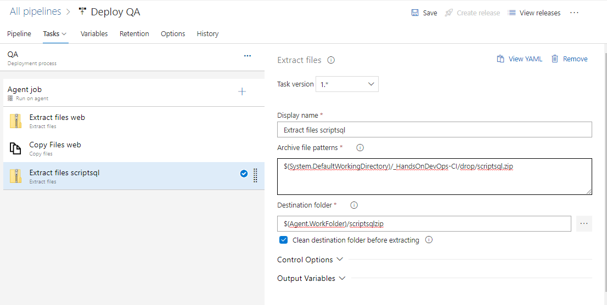

Clicar no **+** do item **Agent job**, digitar **powershell** no campo de pesquisa e selecinar o item **Poweshell** e clicar em **Add**.

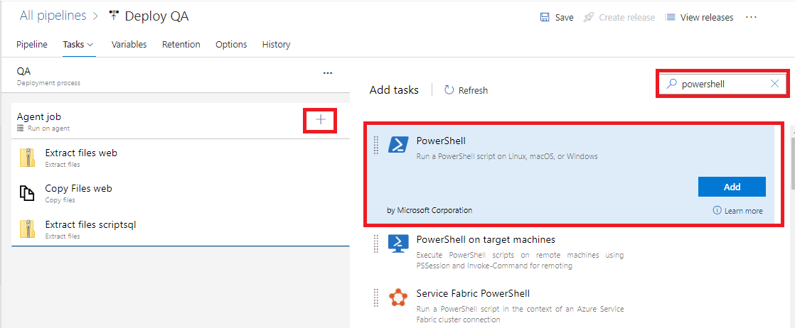

Selecionar o item **PowerShell script** e editar as seguintes propriedades.

| Campo | Valor | 
| --- | --- |
| Display name | Executa Scripts SQL |
| Type | Inline |

Apagar o conteúdo do campo **Script** e copiar o código abaixo para o campo.

```csharp
$path = "$(Agent.WorkFolder)\scriptsqlzip\scriptsql"
$files = Get-ChildItem -Path $path | Sort-Object
$serverInstance = "$(SQLInstance)"
$database = "$(DBName)"
$user = "$(SQLUser)"
$pwd = "$(SQLPassword)"
foreach ($file in $files) {
    $content = Get-Content -Path $file.FullName | Out-String
    $commandSql = "SELECT Id FROM [dbo].[AzureDevOpsMigration] WHERE [NomeArquivo] = '" + $file.Name + "'" 
    $Results = Invoke-Sqlcmd -Query $commandSql -ServerInstance $serverInstance -Database $database -Username $user -Password $pwd 
    if (!$Results.Id) {
        $content = $content.Replace("'", "''")
        $commandSql = "INSERT INTO [dbo].[AzureDevOpsMigration] ([NomeArquivo],[ScriptSQL]) VALUES ('" + $file.Name + "','" + $content + "')"
        $exec = Invoke-Sqlcmd -Query $commandSql -ServerInstance $serverInstance -Database $database -Username $user -Password $pwd 
        Write-Host $exec  
        Write-Host ("Insert script " + $file.Name)   
    }
    else {
        $commandSql = "SELECT Id FROM [dbo].[AzureDevOpsMigration] WHERE [NomeArquivo] = '" + $file.Name + "' AND DataExecucao IS NULL" 
        $Results = Invoke-Sqlcmd -Query $commandSql -ServerInstance $serverInstance -Database $database -Username $user -Password $pwd 
        if ($Results.Id) {
            $content = $content.Replace("'", "''")
            $commandSql = "UPDATE [dbo].[AzureDevOpsMigration] SET [ScriptSQL] = '" + $content + "' WHERE Id = " + $Results.Id.ToString() 
            $exec = Invoke-Sqlcmd -Query $commandSql -ServerInstance $serverInstance -Database $database -Username $user -Password $pwd 
            Write-Host $exec  
            Write-Host ("Update script " + $file.Name)   
        }
    }
}

$commandSql = "select [Id], [NomeArquivo], [ScriptSQL] FROM [dbo].[AzureDevOpsMigration] where DataExecucao is null order by  [NomeArquivo]" 
$Results = Invoke-Sqlcmd -Query $commandSql -ServerInstance $serverInstance -Database $database -Username $user -Password $pwd 

foreach ($Row in $Results) {
    $tranSql = "SET XACT_ABORT ON  `n"
    $tranSql += "BEGIN TRAN `n"
    $tranSql += $Row.ScriptSQL + "`n"
    $tranSql += "UPDATE [dbo].[AzureDevOpsMigration] SET DataExecucao = GETDATE() WHERE Id = " + $Row.Id + "`n"
    $tranSql += "COMMIT TRAN `n"

    $exec = Invoke-Sqlcmd -Query $tranSql -ServerInstance $serverInstance -Database $database -Username $user -Password $pwd 
    Write-Host ("Script executado: ")
    Write-Host $Row.ScriptSQL
}
    
```

Agora vamos criar as variáveis utilizadas pelo script na seção **Variables**.

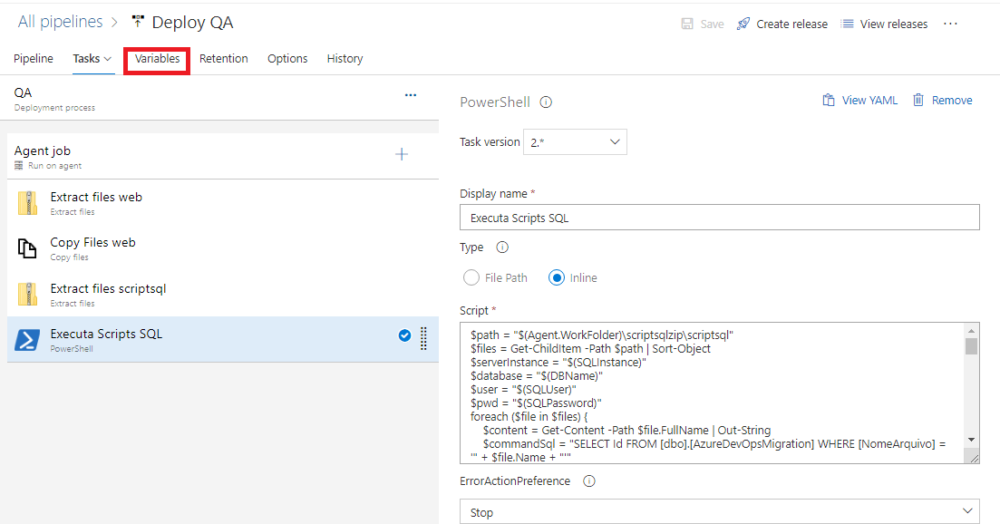

Clicar na opção **+ Add** para adicionar linhas para digitar as variáveis abaixo. 

| Variável | Valor | 
| --- | --- |
| SQLInstance | SERVIDORWEB\SQLEXPRESS |
| DBName | DemoDevOps |
| SQLUser | sa |
| SQLPassword | sa!2016 |

Clicar em **Save** para salvar o pipeline.


Para que seja possível executar os comandos SQL será utilizado um módulo do Powershell, esse módulo tem que ser instalado na VM que tem o agente instalado. 
Inicialmente vamos atualizar o Powershell. Abra um browser na VM e vá para a url **https://www.microsoft.com/en-us/download/details.aspx?id=54616**. 


Selecione o pacote para Windows 2012, realize o download e execute o setup.


Ao final do setup será solicitado o boot do servidor. Após o boot, conectar novamente na VM.
Abrir um console Powershell e digitar o comando **Install-Module -Name SqlServer -AllowClobber** para instalarmos o pacote SQL para habilitar o Powershell a executar comandos SQL. Responder **Y** para as questões do prompt.


Executar o comando **Set-ExecutionPolicy -ExecutionPolicy RemoteSigned** no Powershell e responder **A** para a pergunta do prompt.


Agora temos que configurar o SQL para receber a conexão, para isso vamos usar o **SQL Server Configuration Manager**.

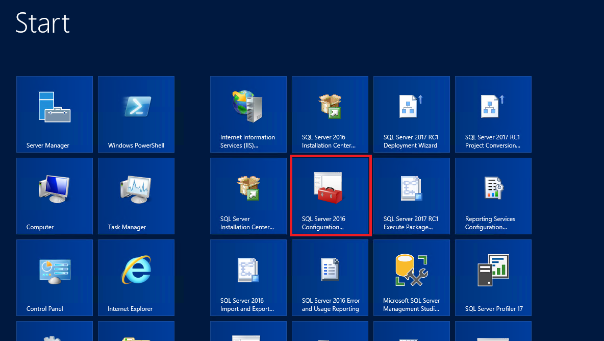

Abrir o item **SQL Server Network Configuration** e clicar em **Protocols for ...**. Clicar no com o botão da direita do mouse no item **TCP/IP** e clicar em **Enable**.


Vamos reiniciar o SQL Server, clicar no item **SQL Server Services** e clicar com o botão direito do mouse no item  **SQL Server(SQLExpress)** e clicar em **Restart**.


Agora vamos habilitar o SQL Server Browser, para isso dar um duplo clique em **SQL Server Browser** e na aba **Service**, mudar o **Start Mode** para **Automatic** e clicar **OK**.

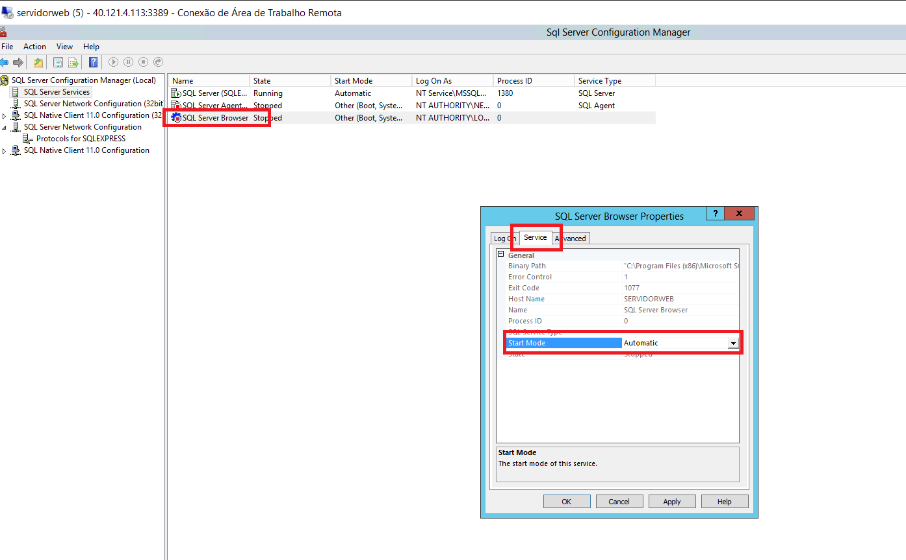

Clicar com o botão da direita do mouse em **SQL Server Browser** e clicar em **Start**.

Agora todos os itens necessários estão configurados, vamos executar o pipeline para vermos a execução do script sql. Para isso abra o Azure DevOps, clique em **Releases** e **Create release**.


Se tudo ocorrer corretamente, o pipeline será executado.

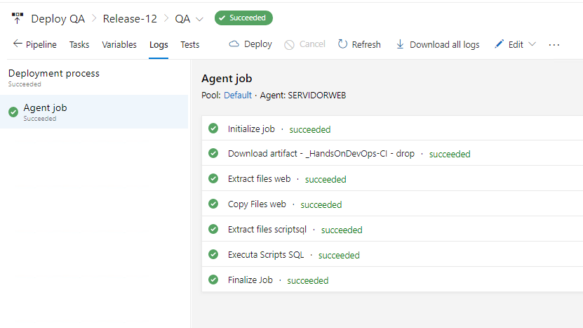

Se for executado um select na tabela **AzureDevOpsMigration** veremos o script executado e o campo criado na tabela cliente.

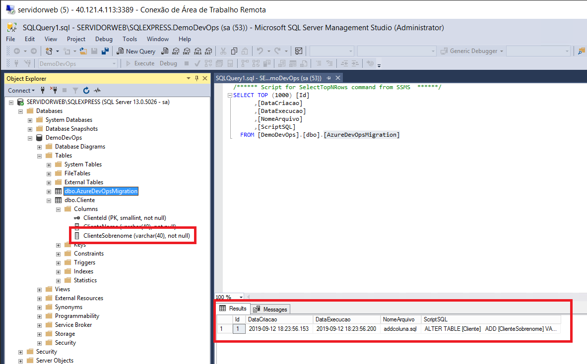